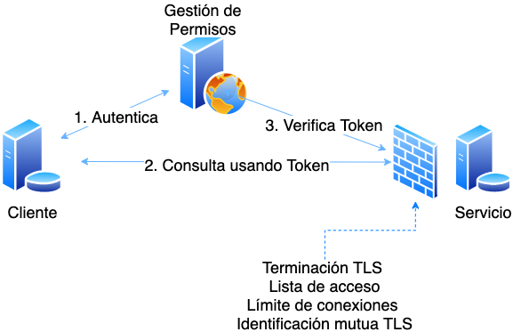

# Gestión de APIs usando Keycloak/RedHat SSO


## A. Gestión de Permisos

El servidor Keycloak ofrece la interfaz grafica para gestionar permisos de clientes y servicios (APIs). Desde Keycloak el administrador puede crear: 

**Reinos**: 
Es un conjunto de servicios, clientes, roles, usuarios, grupos, políticas, etc. Pueden crearse los reinos que sean necesarios, cada uno trabaja de forma independiente.

**Servicios**: Recive peticiones autenticadas usando un token de acceso JWT. Verifica la firma del JWT. Dentro de Keycloak es un cliente en modo 'Bearer-Only'.

**Clientes**: Envia peticiones de login (autenticar) y recive un token de acceso JWT. Realiza consultas al Servicio usando el Token  de acceso JWT. Dentro de Keycloak es un cliente en modo 'Confidential'.



Tanto el Servicio como el Cliente se comunican con Keycloak usando un ID y un Secreto. 


## Ejemplo de Uso

1. Autenticar cliente y obtener token de acceso.
```
~# export CREDENCIAL=`echo -n "id_cliente:secreto_cliente" | base64`;

~# curl -k -H "Authorization: Basic $CREDENCIAL" --request POST \
   --url 'https://logintest.gobiernoelectronico.gob.sv/auth/realms/pruebas/protocol/openid-connect/token' \
   --header 'content-type: application/x-www-form-urlencoded' \
   --data grant_type=client_credentials

{"access_token": TOKEN_JWT ...}

```
2. Consultar servicio usando token de acceso

```
~# curl -H "Authorization: Bearer TOKEN_JWT" https://1.2.3.4/api/v1?nombre=Jose

{"id":1,"content":"Hola, Jose!"}
```


